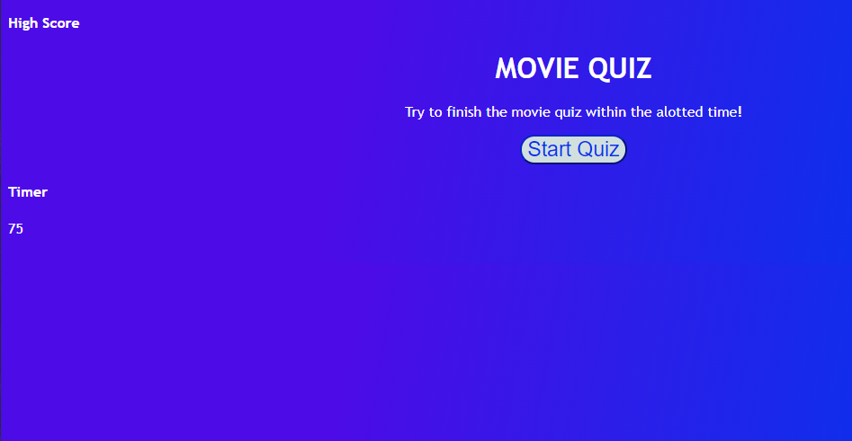

# API Quiz

## The Motivation

What I wanted to do here is work more on my Javascript skills and understand the ins and outs while creating a Quiz. This has helped me further my understanding of the language and can implement it more efficiantly in further projects

## Challenges

This challenge was difficult in terms of switching items within the DOM. I had to use numerous methods to get the quiz to do what it was supposed to do. Specifically, one thing was on how the HTML would pop up stating if the answer was right or wrong. getting that to perform the way it supposed to was a task that took me time.

## Screenshot

## Link
https://itzguled.github.io/api-quiz/